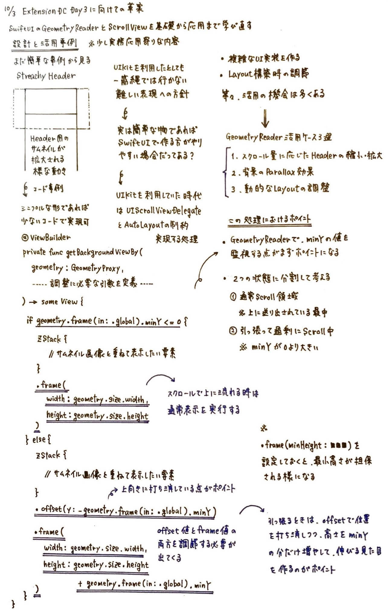
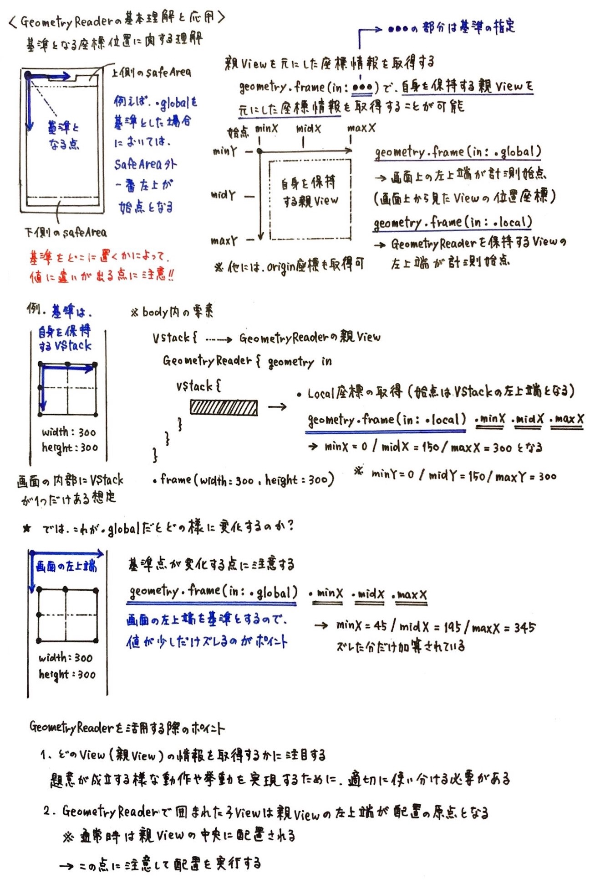
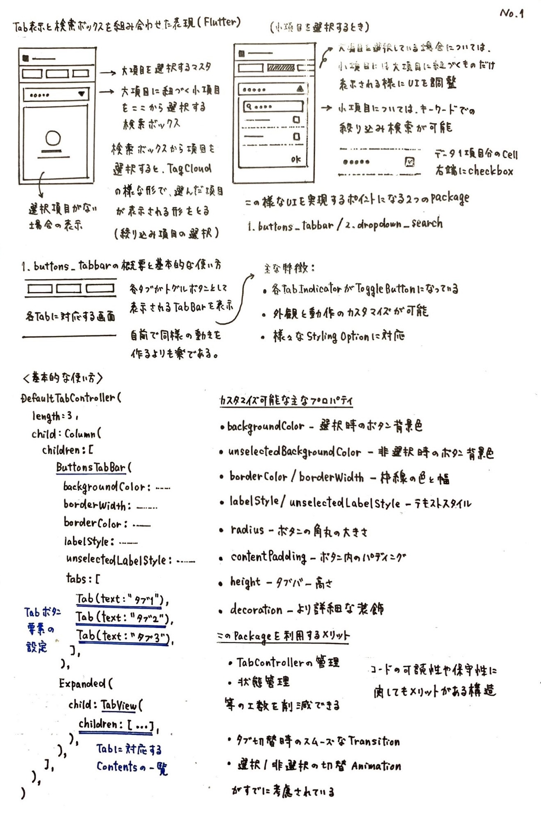
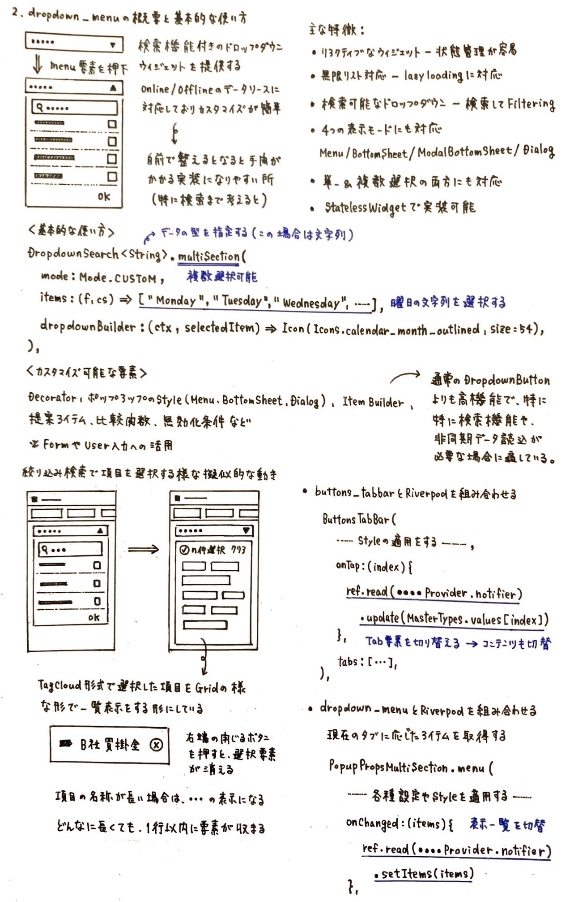

# デザイナー出身モバイルエンジニアが、好きなUIノートと技術同人誌からアウトプットを連鎖させて世界を広げ続ける話

fumiyasac

## アウトプットの原点は「ただのオタク心」だった 

**「このアプリの画面遷移、どうやって実装しているんだろう？」**

**「このボタンのアニメーション、気持ちいいな…」**

デザイナーとしてキャリアをスタートした頃から、僕はアプリのUIの動きを見るのが好きでした。特別な理由があったわけではありません。ただ「面白い」「気になる」という、純粋な興味だけです。そんなオタク心が、今の僕のアウトプット活動の全ての原点になっています。

気づけば、商業誌3冊の執筆、技術同人誌への複数回の寄稿、カンファレンスでの登壇、技術書同人誌博覧会のコアスタッフ活動…と、当時の自分では想像もできなかった場所に立っています。でも、最初から何か特別なスキルや実績があったわけではありません。むしろ、デザイナーからWebエンジニア、そしてモバイルエンジニアへと職種を転々とする中で、技術力に自信が持てない時期も長くありました。

それでも続けてこられたのは、「好きなものを追いかけ、それを形にする」という、ただそれだけのシンプルな行動を積み重ねてきたからです。このガイドブック原稿では、僕がどのようにして小さなアウトプットを連鎖させ、世界を広げてきたのかをお話しします。

## ノートという習慣が全ての始まり

僕のアウトプットの核にあるのは「ノート」です。デザイナー時代から、気になったUIやデザインをスケッチブックに描き起こす習慣がありました。Webエンジニアを経てモバイルエンジニアになった今も、その習慣は続いています。

ノートには、気になったアプリのUIの動き、実装方法のアイデア、技術記事を読んで理解したことの整理、勉強会で聞いた内容のまとめなどを、図解やコードスニペットと一緒に書き留めています。例えば、TCAとReduxの違い、SwiftUIでのNetflix風UI再現、無限Carouselの実装パターン、Androidでよく使うChip型UIのSwiftUI実装…といった具合です。

最初は自分の理解を深めるためだけの「インプット整理ツール」でした。でも、ある時気づいたんです。このノートこそが、僕のアウトプットの「種」になっています。

ノートに書いた内容は、調査内容のスクラップとして活用するだけではなく、小さなサンプルコードとして実装される場合もあります。自分でも更に体系的にまとめて深掘りしたい場合は、QiitaやZennの記事として改めて詳細にまとめる事もありますし、技術コミュニティが主催する勉強会での登壇資料や技術同人誌の原稿のネタとして活用する場合もあります。

この流れを意識的に作ることで、一つのノートのメモが、何度も形を変えながら成長していくのです。これを僕は「アウトプットの多段活用」と呼んでいます。

## 実際のノート事例集

## アウトプットに「疲れてしまった」タイミングをどの様に克服するか？

しかしながら、アウトプットを続けるうちに「義務感」が生まれてしまった時期もあります。

「週に1本は記事を書かなければ」「月に1回は登壇しなければ」という自分ルールに縛られ、気づけばアウトプットが苦痛になっていました。好きで始めたはずなのに、いつの間にか「やらなければならないこと」になっていたのです。

そんな時に立ち戻ったのが、やはり「ノート」でした。

記事や登壇資料を作ることを一旦やめて、ただ「気になったことをノートに書く」だけの日々に戻りました。義務感なく、ただ楽しくて書く。それだけ。そうすると不思議なもので、また「これ、形にしてみたいな」という気持ちが自然と湧いてきたんです。

**アウトプットは、楽しさを失った瞬間に続かなくなります。**

だからこそ、「好き」という原点に立ち戻れる場所を持っておくことが大切だと学びました。

## 技術同人誌がくれた「つながり」という宝物

僕のアウトプット人生を大きく変えたのが、技術同人誌との出会いです。

2018年に、iOSアプリ開発の中でもUI実装に関する知見を紹介した、初めての技術同人誌 **「iOSアプリ開発 UI実装であると嬉しいレシピブック」** を頒布した事がきっかけで、本格的に技術同人誌の世界へ足を踏み入れる事になり、様々なご縁や交流が広がるきっかけとなりました。

また、GMOペパボ株式会社在籍時に、有志で立ち上げた「GMO技術書典部」のメンバーとして、合同執筆の技術同人誌「Good Morning」シリーズに寄稿する機会をいただきました。

- Vol.1: Androidアプリで見る『あの動き』をSwiftUIで実現してみる試み
- Vol.2: 画面遷移処理カスタマイズの基本と宣言的UIにおける考え方の違い
- Vol.3: Quick+Nimbleで書かれたUnitTestを『swift-tsting』に置き換える道標

個人ブログや商業誌とは違う、技術同人誌ならではの魅力がありました。それは **「つながり」** です。

同じ本に寄稿する仲間と、執筆の進捗を共有し、レビューし合い、励まし合う。技術書典のブースで直接読者と対話し、フィードバックをもらう。そして何より、「自分も書いてみたい」と思っている人の背中を押せる存在になれる。この一連の経験が、僕に「アウトプットは一人でやるものじゃない」ということを教えてくれました。

さらに、技術書同人誌博覧会のコアスタッフとして運営に携わるようになったことで、「アウトプットする側」と「アウトプットを支える側」の両方の視点を持てるようになりました。次回案内のデザイン制作に画像生成AIを活用する取り組みや、「技術同人誌を書こう」というテーマでの登壇など、アウトプットを応援する活動そのものが、新たなアウトプットになっていったのです。

iOSエンジニアのコミュニティでも、まだ僕がiOSエンジニアでもなかった頃から本当によくして頂きました。「iOSDC Japan」では2021年から毎年パンフレット原稿を寄稿し、2021年・2023年にはカンファレンス登壇の機会もいただいています。このようにコミュニティから受けた恩を、次の誰かに還元するというサイクルが、僕のアウトプットのモチベーションの1つになっています。

## アウトプットの「連鎖設計」を意識する

ここまでの経験を通じて、僕が大切にしているのが「アウトプットの連鎖設計」という考え方です。

アウトプットには、難易度や到達範囲、準備時間、フィードバックの得やすさなど、さまざまな特性があります。それらを理解した上で、小さなアウトプットから大きなアウトプットへと段階的に育てていくのです。

例えば、こんな流れです：

**1. ノート・スケッチ**

- 気になったことを図解やメモで整理する。誰にも見せない、自分だけのインプット整理。

**2. Xでの投稿**

- ノートの内容を写真に撮って投稿。簡単な解説を添える程度。リアクションが得られやすく、小さな成功体験になる。

**3. サンプルコード作成・GitHub公開** 

- ノートのアイデアを実装して動くものにする。コードとREADMEをGitHubに公開。

**4. QiitaやZennの記事**

- サンプルコードの背景、実装のポイント、ハマった点などを記事化。ストックが増えると後で参照しやすい。

**5. 技術同人誌への寄稿**

- 複数の記事やサンプルをテーマで束ねて、体系的にまとめる。合同執筆なら仲間と励まし合える。

**6. カンファレンス登壇**

- 同人誌で扱ったテーマをプレゼン形式に再構成。質疑応答でさらに深掘りできる。

**7. 商業誌の執筆**

- これまでの全ての知見を集約し、より広い読者に届ける形に昇華させる。

この流れの素晴らしいところは、どの段階からでも始められることです。いきなり商業誌を書く必要はありません。まずはノートに書く。それをXに投稿する。それだけでも立派なアウトプットです。

そして、同じネタを何度も使い回せることも重要なポイントです。ノートに書いた内容が、Twitter投稿になり、記事になり、登壇資料になり、最終的に書籍の一章になる。これは決して手抜きではなく、アウトプットを磨き上げていくプロセスなのです。

## 今日から始める"好きベース"のアウトプット設計術

最後に、これからアウトプットを始めたい、あるいは一度挫折したけれど再挑戦したいという方に向けて、具体的なステップをお伝えします。

**ステップ1：「完璧主義」を手放す**

アウトプットの最大の敵は完璧主義です。「まだ知識が足りない」「もっと勉強してから」「間違っていたら恥ずかしい」…そう思っている間に、時間だけが過ぎていきます。
大切なのは、今の自分が理解していることを、今の自分の言葉で書くこと。間違っていたら後で修正すればいい。不完全でもいいから、まず形にすることです。

**ステップ2：「好き」を起点にする**

義務感からのアウトプットは続きません。「これ面白い！」「誰かに伝えたい！」という気持ちを大切にしてください。
僕の場合は「UIの動きが好き」でした。あなたの「好き」は何ですか？それがアウトプットの最強の原動力になります。

**ステップ3：小さく始めて、連鎖させる**

いきなり大きなアウトプットを目指す必要はありません。まずは一番ハードルの低い形から始めましょう。

- 技術書を読んで面白かったら、その感想をTwitterに3行書く
- 業務で学んだことを、自分用のメモにまとめる
- 気になったUIを、ノートにスケッチしてみる

そこからスタートして、少しずつ形を変え、育てていけばいいのです。

**ステップ4：フィードバックを楽しむ**

アウトプットの醍醐味は、フィードバックです。「参考になりました」「自分も試してみます」という言葉が、次のアウトプットへの大きなエネルギーになります。
最初は反応が少なくても気にしないでください。続けていれば、必ず誰かが見てくれています。

**ステップ5：コミュニティに参加する**

一人でアウトプットするよりも、仲間がいる方が圧倒的に続きます。技術同人誌の合同執筆、勉強会での登壇、オンラインコミュニティでの交流…どんな形でもいいので、「アウトプットする仲間」を見つけてください。

## おわりに：アウトプットが世界を広げてくれる

デザイナーとしてキャリアをスタートした僕が、今こうしてモバイルエンジニアとして、執筆や登壇、コミュニティ運営に携われているのは、すべて「好きなことをアウトプットし続けた」からです。

特別な肩書きも、華々しい実績も、最初は何もありませんでした。ただ「UIの動きが好き」というオタク心と、それを形にしたいという思いだけ。それを、ノートに書き、コードにし、記事にし、本にし、登壇資料にし…と連鎖させてきただけです。

アウトプットは、あなたの世界を確実に広げてくれます。新しい出会いが生まれ、新しい学びが得られ、新しいチャレンジの機会が訪れます。そして何より、誰かの役に立てる喜びを感じられます。

もしこの原稿を読んで、「自分も何かアウトプットしてみようかな」と少しでも思っていただけたなら、それが僕にとっての最高のフィードバックです。

さあ、今日からあなたも「好きベース」のアウトプットを始めてみませんか？
まずはノートを開いて、気になったことを一つ、書いてみることから。

それが、世界を広げる第一歩になるはずです。

#### 著者紹介

    
    

        

            <b>fumiyasac (Fumiya Sakai)</b>
            <a href="https://twitter.com/fumiyasac">Twitter@fumiyasac</a>
        

        

            サークル名：Just1factory
        

    

アプリのUI実装が好きな元デザイナーからジョブチェンジをしたエンジニア。 まだまだ学ぶことは沢山ありますが「整理・負担を軽く」＆「感謝され期待に添えること」の2つをコンセプトに技術を磨く毎日です。平素の業務以外でもQiitaやGithub等でもUI実装に関するサンプルや解説記事を投稿したり主にiOS界隈での勉強会でたまに登壇しています。 アイデアを練ったり、設計のためのメモや図解を作る時はもっぱら手書きで描くことが多いです。

